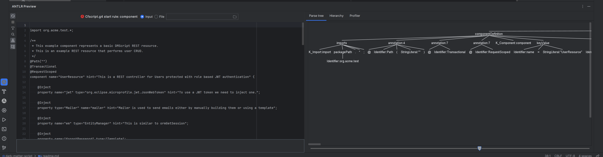

# Dark Matter Script Parser

Parser for DMscript, a language based on (a subset of) cfscript that generates Java from CFscript.
The language is based on cfscript but does not
implement the entire (or even most of) the api.

## How to use this project

To build this project, execute `mvn install` which compiles and bundles this project to a jar file located
in the ./target directory.

### org.ionatomics.Main

You run this class to test the parsers using the dmscript/cfscript code located in the cfscript directory.
Note that once Main has compiled a file to java, it stores a checksum in checksums.txt and will only regenerate that
file once it has changed. Delete the checksums text to regenerate all of them.

### cfscript.object.parser

This directory handles the struct and array parser. Because these objects are complex, I've simplified the 
logic for the main parser by keeping this separate. At some point, it should be folded back into the main parser.

Files of note: 
* Object.g4 This is the grammar for the struct and array 'language'. This grammar is used by Antlr4 to generate the parser.
* ObjectCustomListener contains out custom listener methods.

### cfscript.parser

This directory handles the language parser. The language is a subset of Cfscript with Java annotations added to the
language. In does not handle hash mark interpolation (IE "#1+1#") and does not handle any sort of coldfusion tags.

Files of note:
* Object.g4 This is the grammar for the struct and array 'language'. This grammar is used by Antlr4 to generate the parser.
* ObjectSourceListener contains out custom listener methods (enterComponentDefinition, enterArgumentDefinition, etc).

### Antlr4

You will need an antlr4 plugin if you want code coloring and syntax highlights on the .g4 grammar file. We use
Intellij Idea with the Antlr4 IDE plugin which allows you to view the parse tree for the grammar on some actual code.
This is super helpful when adding new features to the grammar.

When a syntax error occurs, you can see where in the parse tree it breaking down. I'll add examples of implementing
features in this grammar and generating the parser. The new parser files are generated anytime a change is made to
the grammar and `mvn compile` or `mvn install` is run. Compile, builds the grammar files and install generates the jar.

